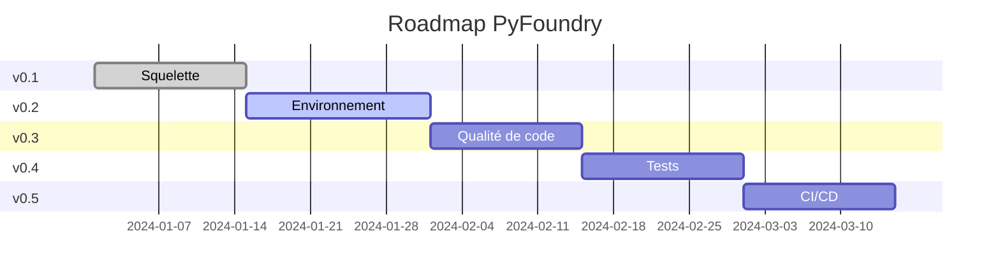

# Roadmap PyFoundry

## Vue d'ensemble

PyFoundry suit une approche de développement **graduelle et itérative**. Chaque version apporte une couche de fonctionnalités cohérente et utilisable en production.

## Versions planifiées

### ✅ v0.1 : Squelette (Actuel)
**Objectif** : Structure de base fonctionnelle avec environnement reproductible

**Fonctionnalités** :
- ✅ Structure de projet standardisée (`src/`, `data/`, `notebooks/`)
- ✅ Configuration devcontainer VS Code avec script externe
- ✅ Environnement virtuel `.venv` automatique
- ✅ Installation conditionnelle d'outils (uv, Node.js, Git)
- ✅ Variables cookiecutter configurables
- ✅ `pyproject.toml` avec dépendances essentielles
- ✅ Documentation utilisateur et développeur complète
- ✅ `.gitignore` adapté Data Science

**Dépendances incluses** :
- `ipykernel`, `ipywidgets` : Support Jupyter
- `python-dotenv` : Configuration par variables d'environnement  
- `gitpython` : Intégration Git programmatique
- `pre-commit` : Préparation pour v0.3

**Options configurables** :
- `use_uv` : Installation d'uv (recommandé)
- `use_node` : Installation Node.js/npm
- `setup_git` : Configuration Git de base

---

### 🚧 v0.2 : Environnement Reproductible  
**Objectif** : Garantir la reproductibilité totale

**Fonctionnalités prévues** :
- [ ] Fichier `uv.lock` pour verrouillage des dépendances
- [ ] Scripts de setup automatisés (`scripts/setup.sh`)
- [ ] Support multi-plateforme (Windows, macOS, Linux)
- [ ] Configuration d'environnement avancée
- [ ] Integration avec Docker Compose (optionnel)

**Améliorations devcontainer** :
- [ ] Variables d'environnement configurables
- [ ] Montage de volumes pour données externes
- [ ] Support GPU (CUDA) optionnel
- [ ] Optimisation de la vitesse de build

---

### 📋 v0.3 : Qualité de Code
**Objectif** : Automatiser la qualité et la cohérence du code

**Fonctionnalités prévues** :
- [ ] Configuration complète `.pre-commit-config.yaml`
- [ ] Configuration `ruff` dans `pyproject.toml`
- [ ] Integration `mypy` pour le typing
- [ ] Formatage automatique (ruff format)
- [ ] Linting avancé et règles métier

**Outils intégrés** :
```yaml
# .pre-commit-config.yaml
repos:
  - repo: https://github.com/astral-sh/ruff-pre-commit
    hooks:
      - id: ruff
      - id: ruff-format
  - repo: https://github.com/pre-commit/mirrors-mypy
    hooks:
      - id: mypy
```

---

### 🧪 v0.4 : Tests Automatisés
**Objectif** : Framework de tests complet

**Fonctionnalités prévues** :
- [ ] Structure de tests avec `pytest`
- [ ] Tests du template avec `pytest-cookies`
- [ ] Coverage reporting avec `pytest-cov`
- [ ] Tests d'intégration pour workflows complets
- [ ] Fixtures et utilitaires de test

**Structure de tests** :
```
tests/
├── __init__.py
├── conftest.py                 # Configuration pytest
├── test_template_generation.py # Tests de génération
├── test_project_structure.py   # Tests de structure
├── test_dependencies.py        # Tests d'installation
└── integration/
    └── test_full_workflow.py   # Tests end-to-end
```

---

### 🚀 v0.5 : CI/CD GitHub Actions
**Objectif** : Automatisation complète et déploiement

**Fonctionnalités prévues** :
- [ ] Workflows GitHub Actions pour tests
- [ ] Tests automatisés sur Pull Requests
- [ ] Publication automatique de la documentation
- [ ] Release automation avec semantic versioning
- [ ] Notifications et reporting

**Workflows** :
```yaml
# .github/workflows/test.yml
name: Test Template
on: [push, pull_request]
jobs:
  test:
    runs-on: ubuntu-latest
    strategy:
      matrix:
        python-version: [3.11, 3.12]
```

---

## Fonctionnalités futures (v1.0+)

### Templates spécialisés
- **PyFoundry-ML** : Template pour Machine Learning
- **PyFoundry-API** : Template pour APIs (FastAPI)
- **PyFoundry-Viz** : Template pour visualisation de données

### Intégrations avancées
- [ ] Support cloud providers (AWS, GCP, Azure)
- [ ] Integration MLflow/Weights & Biases
- [ ] Support Kubernetes/Docker orchestration
- [ ] Template de déploiement (Streamlit, Gradio)

### Outils de développement
- [ ] CLI PyFoundry pour la gestion de projets
- [ ] Plugin VS Code dédié
- [ ] Templates de notebooks pré-configurés
- [ ] Générateur de rapports automatiques

## Critères de qualité

### Définition of Done par version

#### v0.2
- [ ] Tests de génération passent sur Windows/macOS/Linux
- [ ] Devcontainer démarre en moins de 2 minutes
- [ ] Documentation mise à jour
- [ ] Pas de régression v0.1

#### v0.3  
- [ ] Pre-commit hooks configurés et fonctionnels
- [ ] Code généré passe tous les linters
- [ ] Performance : linting en moins de 10s
- [ ] Guide de configuration qualité

#### v0.4
- [ ] Coverage > 90% pour les tests du template
- [ ] Tests d'intégration end-to-end
- [ ] Performance : tests complets en moins de 5 minutes
- [ ] Documentation tests et mocking

#### v0.5
- [ ] CI/CD workflows testés et documentés
- [ ] Déploiement automatique documentation
- [ ] Release process validé
- [ ] Monitoring et alerting basiques

## Calendrier prévisionnel



## Contribution aux versions

### Comment contribuer à v0.2
1. **Issues étiquetées** `v0.2` dans GitHub
2. **Focus** : reproductibilité et environnement
3. **Tests manuels** sur différents OS requis

### Priorisation des features
1. **Impact utilisateur** : Facilite-t-elle l'usage quotidien ?
2. **Complexité technique** : Effort de développement
3. **Maintenance** : Coût de maintenance long terme
4. **Feedback communauté** : Demandes utilisateurs

## Métriques de succès

### v0.2
- **Adoption** : 10+ projets générés et utilisés
- **Performance** : Setup en < 5 minutes
- **Compatibilité** : Fonctionne sur 3 OS majeurs

### v0.3
- **Qualité** : 0 warning sur code généré par défaut
- **Productivité** : 50% réduction temps setup qualité

### v0.4
- **Fiabilité** : 100% tests template passent
- **Couverture** : >90% code coverage

### v0.5
- **Automation** : 100% releases automatisées
- **Monitoring** : Métriques usage disponibles