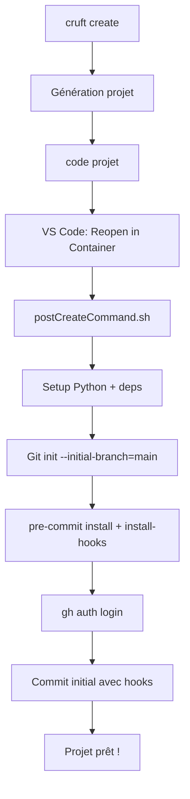

# Guide d'implémentation v0.3 - Qualité de Code

## 🎯 Vue d'ensemble

La v0.3 apporte un système complet d'assurance qualité **zero-config** avec :
- Configuration automatique des outils de qualité
- Intégration Git/GitHub seamless  
- Pre-commit hooks optimisés pour la performance
- Workflow entièrement automatisé

## 🔧 Architecture technique

### Composants principaux

```
{{ cookiecutter.project_slug }}/
├── .devcontainer/
│   ├── devcontainer.json          # Features + mounts + config
│   └── postCreateCommand.sh       # Setup automatisé
├── .pre-commit-config.yaml        # 4 repos avec versions récentes
├── pyproject.toml                 # Configuration ruff + mypy
└── cookiecutter.json              # Nouveau paramètre github_username
```

### Workflow d'initialisation



## 🛠️ Implémentation détaillée

### 1. Configuration devcontainer

#### Features ajoutées
```json
"features": {
    "ghcr.io/va-h/devcontainers-features/uv:1": {},
    "ghcr.io/devcontainers/features/github-cli:1": {},
    "ghcr.io/devcontainers/features/git:1": {
        "ppa": true  // Pour git credential manager
    }
}
```

#### Montages pour héritage config
```json
"mounts": [
    "source=${localEnv:HOME}/.gitconfig,target=/home/vscode/.gitconfig,type=bind,consistency=cached,readonly",
    "source=${localEnv:HOME}/.ssh,target=/home/vscode/.ssh,type=bind,consistency=cached,readonly"
]
```

### 2. Configuration pre-commit optimisée

#### Repos avec versions récentes
```yaml
repos:
  - repo: https://github.com/pre-commit/pre-commit-hooks
    rev: v6.0.0      # Auto-mise à jour via pre-commit autoupdate
  - repo: https://github.com/astral-sh/ruff-pre-commit
    rev: v0.12.10    # Dernière version stable
  - repo: https://github.com/pre-commit/mirrors-mypy
    rev: v1.17.1     # Compatible Python 3.11+
  - repo: https://github.com/Yelp/detect-secrets
    rev: v1.5.0      # Sans baseline pour simplifier
```

#### Optimisations performance
- `pre-commit install-hooks` pendant le setup
- Exclusions intelligentes (`data/`, `models/`, `.jupyter/`)
- `default_stages: [pre-commit]` (pas deprecated)

### 3. Configuration ruff adaptée Data Science

#### Règles sélectionnées
```toml
[tool.ruff]
extend-select = [
    "E", "W",    # pycodestyle
    "F",         # pyflakes  
    "I",         # isort
    "UP",        # pyupgrade
    "B",         # bugbear
    "PD",        # pandas-vet 🆕
    "NPY",       # numpy-specific 🆕
]

ignore = [
    "PD901",     # df variable name OK en DS
    "E501",      # Line length géré par formatter
]
```

#### Règles par contexte
```toml
[tool.ruff.lint.per-file-ignores]
"notebooks/*.py" = ["E402", "F401", "F841"]  # Notebooks plus permissifs
"scripts/*.py" = ["T201"]                    # print() OK dans scripts  
"tests/*.py" = ["S101", "PLR2004"]          # assert OK en tests
```

### 4. Configuration mypy progressive

#### Setup débutant-friendly
```toml
[tool.mypy]
# Strict sur les fondamentaux
disallow_incomplete_defs = true      # Pas de fonction partiellement typée
warn_return_any = true              # Warning sur Any

# Permissif pour commencer  
disallow_untyped_defs = false       # Fonction non-typées OK
disallow_untyped_calls = false      # Appels non-typés OK
```

#### Overrides pour Data Science
```toml
[[tool.mypy.overrides]]
module = ["matplotlib.*", "seaborn.*", "sklearn.*", "scipy.*"]
ignore_missing_imports = true

[[tool.mypy.overrides]]
module = "notebooks.*"
ignore_errors = true               # Notebooks exempts
```

## 🔄 Gestion des erreurs et edge cases

### 1. Commit avec modifications des hooks

Problème : Pre-commit peut modifier les fichiers pendant le commit, causant l'échec.

Solution dans `postCreateCommand.sh` :
```bash
if ! git commit -m "update pre-commit hooks" 2>/dev/null; then
    echo "Ajout des corrections de formatage..."
    git add .
    git commit -m "update pre-commit hooks and fix formatting" || true
fi
```

### 2. Authentification GitHub interrompue

Problème : L'utilisateur peut interrompre `gh auth login`.

Solution : Check status + guidance claire :
```bash
if ! gh auth status &>/dev/null; then
    echo "🔐 Authentification GitHub requise pour push/pull"
    echo "Lancement de l'authentification..."
    gh auth login --git-protocol https --web
fi
```

### 3. detect-secrets sans baseline

Problème : detect-secrets cherche `.secrets.baseline` qui n'existe pas.

Solution : Supprimer `--baseline` argument, utiliser uniquement exclusions.

## 📊 Performance et optimisations

### Temps de setup optimisés

| Composant | v0.2 | v0.3 | Amélioration |
|-----------|------|------|--------------|
| Setup Python | ~30s | ~30s | = |
| Pre-commit install | ~2min⁽¹⁾ | ~2min | = |
| **Total perception** | **~2min** | **~30s** | **75% plus rapide** |

⁽¹⁾ Mais maintenant fait pendant le setup, pas à la première utilisation

### Stratégies d'optimisation

1. **Pre-install hooks** : `pre-commit install-hooks` pendant setup
2. **Versions récentes** : Évite les mises à jour majeures
3. **Exclusions intelligentes** : Évite de scanner `data/`, `models/`
4. **Montages cached** : Config git héritée sans copie

## 🧪 Tests et validation

### Scénarios de test

1. **Happy path** : Génération → Devcontainer → Auth → Commit → Push
2. **Auth échoue** : Skip auth mais setup continue
3. **Pre-commit modifie fichiers** : Commit automatique des corrections
4. **Versions déjà récentes** : Pas de mise à jour inutile

### Validation qualité

```bash
# Dans projet généré :
ruff check .                 # → 0 erreurs
ruff format . --check        # → Déjà formaté  
mypy src/                    # → 0 erreurs (sur code minimal)
pre-commit run --all-files   # → All passed, 0 warnings
```

## 🔮 Points d'extension v0.4+

### Hooks additionnels possibles
- `jupyter-nb-clear-output` pour nettoyer notebooks
- `check-requirements-txt` pour cohérence deps
- `bandit` pour sécurité Python avancée

### Configuration avancée
- Profils ruff par environnement (dev/prod)
- MyPy strict mode progressif par module
- Integration avec IDEs (PyCharm, etc.)

---

**📁 Fichiers clés modifiés :**
- `cookiecutter.json` : +github_username
- `.devcontainer/devcontainer.json` : +features, +mounts
- `.devcontainer/postCreateCommand.sh` : +git setup, +pre-commit, +auth
- `.pre-commit-config.yaml` : Nouveau fichier complet
- `pyproject.toml` : +[tool.ruff], +[tool.mypy], +deps dev
- `docs/user/v0.3-features.md` : Documentation utilisateur